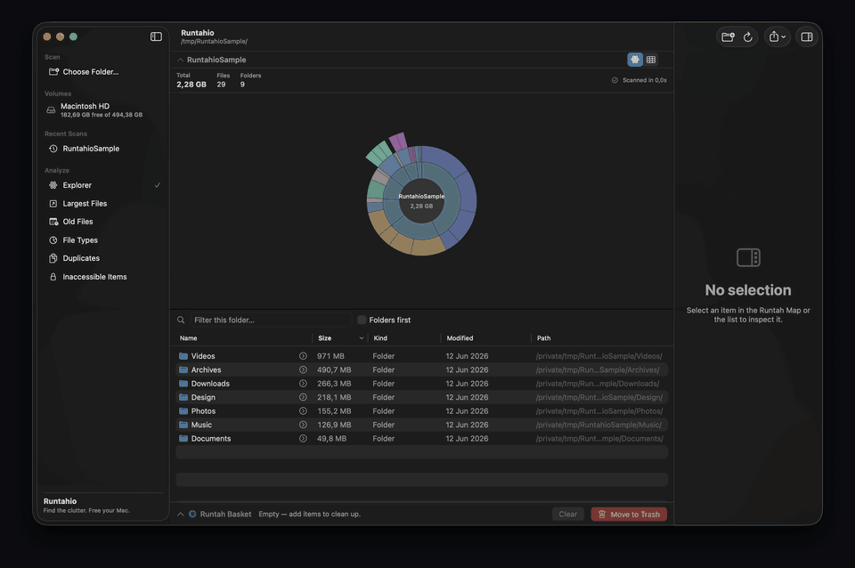
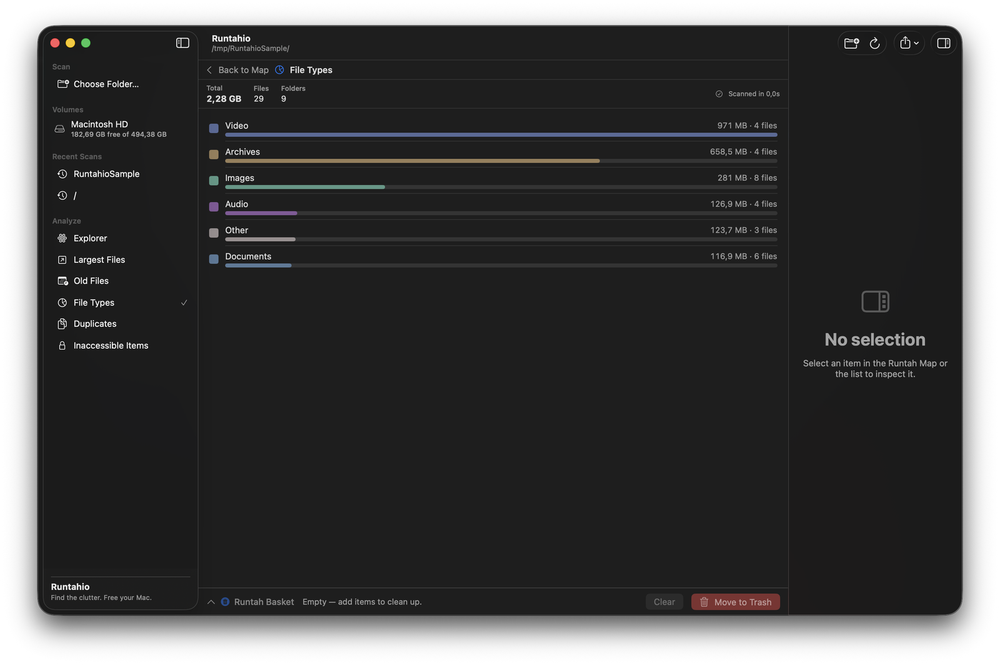

# Runtahio

**Find the clutter. Free your Mac.** · _Beresin storage Mac kamu._

[](https://github.com/cupskeee/runtahio/actions/workflows/ci.yml)
[](LICENSE)


Runtahio is a **free, open-source, local-only** macOS disk-usage visualizer and safe cleanup
utility. It scans a folder or volume, shows what's taking up space with an interactive radial
**Runtah Map** (or a treemap), lets you inspect files, and safely moves unwanted items to the
Trash after a strong confirmation. Everything happens on your Mac — no network, no telemetry.

> _"Runtah"_ is Sundanese/Indonesian-flavored wording for trash or clutter. The UI is mainly
> English, with a light Indonesian flavor available in the branding and status microcopy.

## Download

**[⬇ Download the latest release](https://github.com/cupskeee/runtahio/releases/latest)** for
macOS (Apple Silicon) — or install with [Homebrew](#install).

Prefer building from source? See [Build from source](#build-from-source).

## Demo

<p align="center">
  
</p>

<p align="center"><em>One scan, three views — the radial <strong>Runtah Map</strong>, the squarified <strong>treemap</strong>, and the <strong>File Types</strong> breakdown.</em></p>

## Why Runtahio?

- **Free and open source** (MIT) — no paywall, no account.
- **Native SwiftUI Mac app** — not Electron, not a web wrapper.
- **Local-only** — no network, telemetry, or analytics (guarded by a test).
- **Metadata-only scanning** — never reads your file contents.
- **Trash-only cleanup** — no permanent-delete path; protected system paths can't be staged.
- **Two visualizations** — the radial Runtah Map and a squarified treemap.
- **Built-in analysis** — largest files, old files, file types, duplicates, inaccessible items.
- **English and Bahasa Indonesia.**

### Compared with other tools

| Tool | How Runtahio differs |
|---|---|
| **DaisyDisk** | Commercial and closed-source; Runtahio is free, open-source, and local-only. |
| **GrandPerspective** | A great free treemap viewer; Runtahio adds a radial map, safe Trash-only cleanup, duplicate detection, and dedicated analysis views. |
| **ncdu / du** | Terminal tools; Runtahio is a native graphical app with interactive visualizations and one-click safe cleanup. |

## Features

- **Scan** any folder or volume recursively, off the main thread, reading *metadata only*
  (never file contents). It doesn't follow symlinks, and excludes `.nofollow` by default —
  a special macOS root directory that mirrors the whole filesystem and would otherwise
  double-count almost the entire disk when scanning `/`.
- **Visualize** usage two ways: the original radial **Runtah Map** "bloom" sunburst (angle
  proportional to size, colored by file type, tiny items collapsed into "Other"), or a
  squarified **treemap** — switchable per scan, with animated zoom transitions on drill
  in/out. Hover to highlight, click to select, double-click to drill, center/margin to go
  back up.
- **Browse** a sortable, searchable file table (Name / Size / Kind / Modified / Path) with
  folders-first and per-folder filtering.
- **Inspect** any item: name, full path, logical & allocated size, kind, dates, flags
  (file/folder/package/symlink, hidden, readable), child counts, and any scan error.
- **Clean up safely** via the **Runtah Basket**: stage items, see the total reclaimable
  size, then **Move to Trash** after a confirmation dialog. Files are never permanently
  deleted, and dangerous system locations can't be added.
- **Analyze** the whole scan with dedicated views: **Largest Files**, **Old Files**,
  a **File Types** breakdown, **Duplicates** (same name + size, with one-click "add the
  extras to the basket"), and **Inaccessible Items**.
- **Export** a scan report as JSON or CSV (local only), and watch **Lapang Mode** tally how
  much space you've freed this session.
- Scan **internal and external volumes** from the sidebar, each showing free/total capacity,
  with eject for removable drives (the list refreshes when drives mount/unmount).
- Use the app in **English or Bahasa Indonesia** (the interface language is selectable;
  Indonesian also turns on the playful Sundanese status microcopy).
- A first-run **onboarding** screen and an original app icon round out the experience.

## Screenshots

<p align="center">
  
  <br>
  <em>The squarified <strong>treemap</strong> (left) and the <strong>File Types</strong> analysis view (right).</em>
</p>

> Screenshots use a synthetic sample folder — no real files. See [`docs/images/`](docs/images/).

## Install

### Homebrew (recommended)

```bash
brew tap cupskeee/runtahio
brew install --cask runtahio
```

> The app is ad-hoc signed and **not notarized**, so on first launch macOS Gatekeeper may
> block it. Right-click **Runtahio.app → Open**, or remove the quarantine flag:
> `xattr -dr com.apple.quarantine /Applications/Runtahio.app` — or install without it:
> `brew install --cask --no-quarantine runtahio`.

### Direct download

[Download the latest release](https://github.com/cupskeee/runtahio/releases/latest), unzip,
and move **Runtahio.app** to `/Applications`. The same Gatekeeper note applies.

### Build from source

Runtahio is a single Swift Package with `RuntahioCore` (pure, testable logic), `Runtahio`
(the SwiftUI app), `RuntahioBench` (a headless benchmark), and `RuntahioCoreTests`.

```bash
swift test                       # run the headless unit tests (no network)
./Scripts/make-app.sh --run      # build the signed .app bundle and launch it
open Package.swift               # or open in Xcode and run the Runtahio scheme
```

> **Why the `.app` bundle?** A bare `swift run` executable launches as a *background* process
> (no menu bar, never frontmost) and its binary path changes every build, so macOS's Full
> Disk Access grant never sticks. `Scripts/make-app.sh` wraps the binary into a `Runtahio.app`
> with a fixed bundle identifier (`com.runtahio.app`) and an ad-hoc signature, giving it a
> real menu bar, a frontmost window, and a stable identity. Options: `--debug`, `--no-sign`,
> `--run`.

## Privacy & Safety

> **Runtahio scans file metadata locally on your Mac. It does not upload file names, paths,
> sizes, or contents.**

### Safety guarantees

Runtahio is designed to avoid accidental data loss:

- **Never permanently deletes** — uses the macOS **Trash only** (`FileManager.trashItem`);
  trashed items stay recoverable.
- **Always confirms** before moving anything to Trash (item count, total size, largest
  paths) — even if "confirm before Trash" is turned off in Settings.
- **Protected system paths** — the disk root, `/System`, `/Library`, `/usr`, volume mount
  roots, your entire Home folder, and more — **cannot be added** to the basket.
- **Never reads file contents** — only metadata (`URLResourceValues`); never materializes
  cloud (dataless) files.
- **No network** — never sends file names, paths, sizes, or contents anywhere. No telemetry,
  no analytics.
- **Tested** — the protected-path matrix, the Trash flow (with a recoverable-copy assertion
  proving nothing is permanently deleted), privacy/wording guardrails, and scan correctness.

### Privacy details

- The only external link in the app is a local System Settings deep link
  (`x-apple.systempreferences:`) to help you grant Full Disk Access. A unit test rejects any
  `http(s)` URL in the codebase.

### How cleanup works

- Nothing is trashed from a map click — items go into the **Runtah Basket** first.
- The basket de-duplicates nested items so totals never double-count, and per-item trash
  failures are isolated and reported rather than aborting the whole operation.

## Performance

Runtahio scans **metadata only** — it never opens or reads file contents — so speed scales
with the number of files, not their size.

| Synthetic target | Files | Folders | Scan time | Peak memory |
|---|---:|---:|---:|---:|
| 10,000 files | 10,000 | 51 | 0.18 s | 31 MB |
| 100,000 files | 100,000 | 510 | 1.64 s | 207 MB |
| 250,000 files | 250,000 | 1,275 | 5.24 s | 503 MB |

Measured on an Apple M4 Pro (48 GB), macOS 26.5, release build, against synthetic trees from
[`Scripts/benchmark.sh`](Scripts/benchmark.sh). The full node index is held in memory
(~2 KB/file), so very large scans use proportional memory. Numbers vary by machine and disk.

## Requirements

- **macOS 26 (Tahoe) or later**, Apple Silicon.
- Building from source: Xcode 26 / Swift 6.2. No third-party dependencies.

## Full Disk Access

To scan system-protected locations, Runtahio needs **Full Disk Access**:

1. Open **System Settings → Privacy & Security → Full Disk Access**.
2. Add the `Runtahio.app` you launched and turn it on.
3. Quit and reopen Runtahio, then rescan.

See the **[Full Disk Access troubleshooting guide](docs/full-disk-access.md)** if a scan
still reports inaccessible items, or the grant doesn't seem to stick.

> **Honest limitation:** because the app is ad-hoc signed, each time you *rebuild* it from
> source macOS sees it as a new app and you may need to grant Full Disk Access again. Use the
> `.app` bundle (not the raw `swift run` binary) for a stable identity. Folders you own (like
> `~/Downloads`) scan fine without Full Disk Access.

## Keyboard shortcuts

| Shortcut | Action |
|---|---|
| ⌘O | Choose folder to scan |
| ⌘R | Rescan |
| Esc | Cancel scan, then clear selection / filter |
| ⌘↑ | Go to parent folder |
| ⌘⌫ | Add selected item to Runtah Basket |
| ⌘⇧⌫ | Move Runtah Basket to Trash (with confirmation) |
| ⌥⌘I | Toggle inspector |
| ⌘1–⌘6 | Switch view (Explorer / Largest / Old / Types / Duplicates / Inaccessible) |
| ⇧⌘T | Toggle between the Runtah Map and the treemap |
| ⌘E | Export report as JSON |
| ⌘, | Settings |

Double-click a folder (in the map or table) to drill in; the table's Preview and the
inspector's Quick Look button open a Quick Look preview (falling back to Open if the preview
panel is unavailable).

## Architecture

```
Package.swift                      swift-tools-version 6.2, macOS 26, no dependencies
Sources/RuntahioCore/              Pure, testable logic (no SwiftUI, no @main)
  DiskNode, ScanModels, ScanError  Immutable, Sendable data model
  ScannerService                   actor → AsyncStream<ScanEvent>, off-main recursive scan
  DiskNodeStore                    @MainActor removal overlay (no tree mutation)
  RadialLayoutEngine               Pure sunburst geometry + hit-testing
  TreemapLayoutEngine              Pure squarified treemap layout + hit-testing
  ProtectedPathPolicy              Component-wise protected-path rules
  RuntahBasket, CleanupService     Dedup + Trash-only cleanup
  ScanAnalytics                    Largest / old / types / duplicates / inaccessible
  ScanReportExporter               JSON + CSV report generation
  VolumeInfo, VolumeScanner        Mounted-volume model + classification
  Localization (AppLanguage/Strings)  English + Bahasa Indonesia UI strings
  AppSettings, RecentScansStore    UserDefaults-backed @Observable state
  ByteSizeFormatter, Microcopy     Formatting + flavor-aware status microcopy
Sources/Runtahio/                  SwiftUI app: RuntahioApp + views + AppKit/QuickLook
  RuntahMapView, TreemapView       The two visualizations (SwiftUI Canvas)
  AnalysisView, OnboardingView…    Analysis views, onboarding, shared NodeUI/menus
Sources/RuntahioBench/             Headless scanner benchmark (see Scripts/benchmark.sh)
Tests/RuntahioCoreTests/           85 XCTest cases over the Core library
Scripts/make-app.sh                Wraps the binary into a signed Runtahio.app (+ icon)
Scripts/generate-icon.swift        Renders the original "bloom" app iconset
```

Concurrency is Swift 6 strict-mode clean: the scanner runs as an `actor` and emits a single
ordered `AsyncStream<ScanEvent>`; the `DiskNode` tree is **immutable after a scan** (so it's
safely `Sendable`), and post-trash removals are tracked as an id overlay on a `@MainActor`
store rather than by mutating the shared tree.

## Tests

`swift test` runs 85 headless XCTest cases covering scanner aggregation (nested sizes,
symlinks not followed, hidden counting, packages, inaccessible directories, cancellation),
radial and treemap layout (angle-sum / area-conservation / hit-test round-trips), the full
protected-path matrix, basket dedup/overlap-safe totals, the Trash flow against real temp
files (with a recoverable-copy assertion proving nothing is permanently deleted), analytics
(largest/oldest/types/duplicates), JSON/CSV export round-trips and CSV quoting, volume
classification, localization (English/Indonesian), byte formatting, and privacy/wording
guardrails.

## Roadmap

- **Broader macOS support** — lower the deployment target below macOS 26 where the APIs allow.
- **Homebrew** — graduate from the [tap](https://github.com/cupskeee/homebrew-runtahio) toward
  an official Homebrew cask (needs Developer ID notarization).
- Notarized, Developer-ID-signed releases (no Gatekeeper prompt).
- Universal (Intel + Apple Silicon) build.
- Compare two scans over time.
- More localizations beyond English / Bahasa Indonesia.
- Optional on-disk scan cache for very large volumes.
- Accessibility improvements (VoiceOver on the visualizations).

Want to help? See the
[good first issues](https://github.com/cupskeee/runtahio/issues?q=is%3Aissue+is%3Aopen+label%3A%22good+first+issue%22).

> Already shipped: the treemap + animated drill, external-drive handling with eject,
> English/Indonesian localization, the largest/old/types/duplicates/inaccessible views,
> JSON/CSV export, the app icon, onboarding, "Lapang Mode", CI + 85 tests, release
> automation, a Homebrew tap, and a benchmark harness.

## Known limitations

- Full Disk Access does not persist across rebuilds of an ad-hoc-signed binary (see above).
- The full node index is held in memory; extremely large scans (many millions of files) use
  proportional memory. There is no on-disk scan cache yet.
- The Runtah Map redraws on drill in/out rather than animating between states; very dense
  levels collapse tiny items into "Other" and the synchronized table is the accessible /
  high-density fallback.
- Quick Look uses a best-effort panel bridge and falls back to "Open" if the preview panel
  can't attach.
- Not sandboxed (so it can scan broadly and move items to Trash); not notarized / not
  configured for App Store distribution.

## Contributing & community

Contributions are welcome — including the [good first issues](https://github.com/cupskeee/runtahio/issues?q=is%3Aissue+is%3Aopen+label%3A%22good+first+issue%22).
Please start with:

- **[CONTRIBUTING.md](CONTRIBUTING.md)** — how to build, test, and submit changes, plus the
  project invariants (local-only, metadata-only, Trash-only, Swift 6 strict concurrency).
- **[CODE_OF_CONDUCT.md](CODE_OF_CONDUCT.md)** — the Contributor Covenant we follow.
- **[SECURITY.md](SECURITY.md)** — how to report a vulnerability privately.
- **[CHANGELOG.md](CHANGELOG.md)** — notable changes per release.

Bug reports and feature requests go through the
[issue templates](https://github.com/cupskeee/runtahio/issues/new/choose). CI runs the build,
tests, and `swift-format` lint on every push and pull request.

## License

Runtahio is released under the [MIT License](LICENSE).

## Disclaimer

Runtahio is an original macOS storage visualizer. **It is not affiliated with, endorsed by, or
derived from DaisyDisk**, and it does not copy DaisyDisk's name, branding, icon, colors,
layout, wording, screenshots, or assets. It shares only the general idea of a visual
disk-space analyzer. All processing is local; files are moved to the Trash only after your
confirmation.
