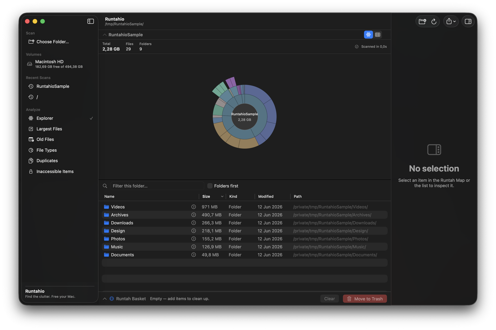
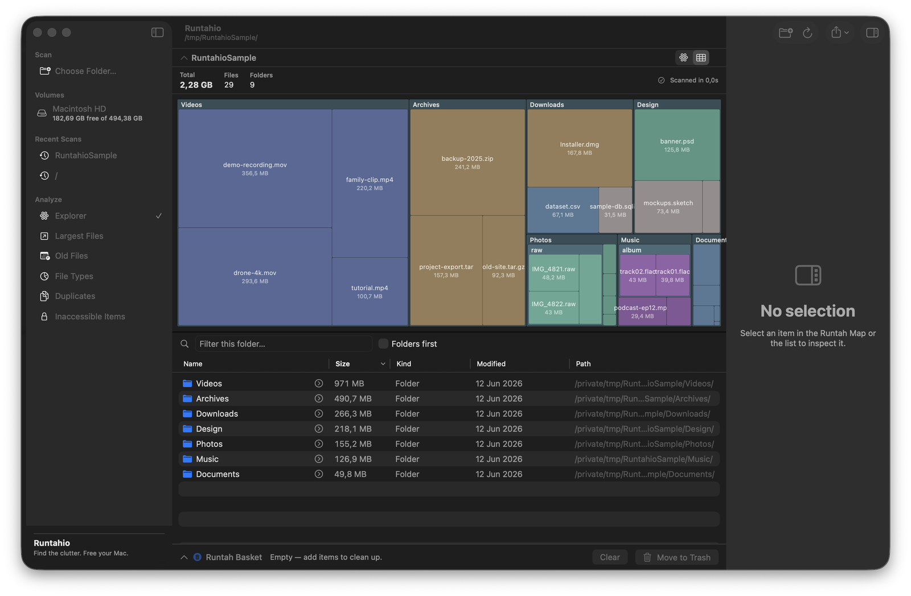

# Runtahio

**Find the clutter. Free your Mac.** · _Beresin storage Mac kamu._

[](https://github.com/cupskeee/runtahio/actions/workflows/ci.yml)
[](LICENSE)


Runtahio is an original, native macOS disk-usage visualizer and safe cleanup utility. It
scans a folder or volume, shows what is taking up space with an interactive radial **Runtah
Map**, lets you inspect files and folders, and safely moves unwanted items to the Trash
after a strong confirmation. Everything happens locally — no network, no telemetry.

> _“Runtah”_ is Sundanese/Indonesian-flavored wording for trash or clutter. The UI is
> mainly English, with a light Indonesian flavor available in the branding and status
> microcopy.

---

## Screenshots

> _Screenshots coming soon._ See [`docs/images/`](docs/images/) for the planned shots and
> capture tips; uncomment the tags below once the images are added.

<!--
<p align="center">
  <br>
  <em>The radial Runtah Map — angle ∝ size, colored by file type.</em>
</p>
<p align="center">
  <br>
  <em>The squarified treemap, switchable per scan.</em>
</p>
-->

## What Runtahio does

- **Scan** any folder or volume recursively, off the main thread, reading *metadata only*
  (never file contents). It doesn't follow symlinks, and excludes `.nofollow` by default —
  a special macOS root directory that mirrors the whole filesystem and would otherwise
  double-count almost the entire disk when scanning `/`.
- **Visualize** usage two ways: the original radial **Runtah Map** "bloom" sunburst (angle
  proportional to size, colored by file type, tiny items collapsed into "Other"), or a
  squarified **treemap** — switchable per scan, with animated zoom transitions on drill
  in/out. Hover to highlight, click to select, double-click to drill, center/margin to go
  back up.
- **Browse** a sortable, searchable file table (Name / Size / Kind / Modified / Path) with
  folders-first and per-folder filtering.
- **Inspect** any item: name, full path, logical & allocated size, kind, dates, flags
  (file/folder/package/symlink, hidden, readable), child counts, and any scan error.
- **Clean up safely** via the **Runtah Basket**: stage items, see the total reclaimable
  size, then **Move to Trash** after a confirmation dialog. Files are never permanently
  deleted, and dangerous system locations can't be added.
- **Analyze** the whole scan with dedicated views: **Largest Files**, **Old Files**,
  a **File Types** breakdown, **Duplicates** (same name + size, with one-click "add the
  extras to the basket"), and **Inaccessible Items**.
- **Export** a scan report as JSON or CSV (local only), and watch **Lapang Mode** tally how
  much space you've freed this session.
- Scan **internal and external volumes** from the sidebar, each showing free/total capacity,
  with eject for removable drives (the list refreshes when drives mount/unmount).
- Use the app in **English or Bahasa Indonesia** (the interface language is selectable;
  Indonesian also turns on the playful Sundanese status microcopy).
- A first-run **onboarding** screen and an original app icon round out the experience.

## Requirements

- macOS 26 or later (built and verified on macOS 26.x, Apple Silicon).
- Xcode 26 / Swift 6.2 toolchain (for building from source).
- No third-party dependencies. No network access.

## Build & run

Runtahio is a single Swift Package with three targets: `RuntahioCore` (pure, testable
logic), `Runtahio` (the SwiftUI app), and `RuntahioCoreTests`.

```bash
# Run the unit tests (headless, no network):
swift test

# Build a real, launchable .app bundle (recommended way to run):
./Scripts/make-app.sh            # release build, ad-hoc signed → ./Runtahio.app
./Scripts/make-app.sh --run      # build and launch
open ./Runtahio.app

# Or open the package in Xcode and run the Runtahio scheme:
open Package.swift
```

> **Why the `.app` bundle?** A bare `swift run` executable launches as a *background*
> process (no menu bar, never frontmost) and its binary path changes every build, so
> macOS's Full Disk Access grant never sticks to it. `Scripts/make-app.sh` wraps the
> binary into a `Runtahio.app` with a fixed bundle identifier (`com.runtahio.app`) and an
> ad-hoc signature, giving it a real menu bar, a frontmost window, and a stable identity
> for Full Disk Access.

`make-app.sh` options: `--debug` (debug build), `--no-sign` (skip codesign), `--run`.

## Privacy

> **Runtahio scans file metadata locally on your Mac. It does not upload file names,
> paths, sizes, or contents.**

- No network requests of any kind. No telemetry. No analytics.
- Runtahio reads only filesystem *metadata* (`URLResourceValues`) — it never opens or
  reads the contents of your files, and never materializes cloud (dataless) files.
- The only external link in the app is a local System Settings deep link
  (`x-apple.systempreferences:`) to help you grant Full Disk Access. A unit test guards
  against any `http(s)` URLs slipping into the codebase.

## Safety behavior

- Cleanup is **Move to Trash only** — Runtahio uses `FileManager.trashItem(...)` and never
  permanently deletes. Trashed items remain recoverable from the macOS Trash.
- Nothing is ever trashed from a map click. Items must first be added to the **Runtah
  Basket**, and the basket's **Move to Trash** always shows a confirmation dialog (with the
  item count, total size, and the largest paths) — even if "confirm before Trash" is
  turned off in Settings.
- **Protected paths can't be added to the basket.** Component-wise path matching blocks the
  disk root (`/`), system domains (`/System`, `/Library`, `/usr`, `/bin`, `/sbin`, `/etc`,
  `/var`, `/private/...`, …), volume mount roots (`/Volumes/<name>`), and your entire Home
  folder — while still allowing subfolders like `~/Downloads`. Adding the scanned root
  itself requires an explicit extra confirmation.
- The basket de-duplicates nested items, so totals never double-count, and per-item trash
  failures are isolated and reported rather than aborting the whole operation.

## Full Disk Access

To scan system-protected locations, Runtahio needs **Full Disk Access**:

1. Open **System Settings → Privacy & Security → Full Disk Access**.
2. Add the `Runtahio.app` you launched and turn it on.
3. Quit and reopen Runtahio, then rescan.

> **Honest limitation:** because the app is ad-hoc signed, each time you *rebuild* it from
> source macOS sees it as a new app and you may need to grant Full Disk Access again. Use
> the `.app` bundle (not the raw `swift run` binary) for a stable identity. Folders you own
> (like `~/Downloads`) scan fine without Full Disk Access.

## Keyboard shortcuts

| Shortcut | Action |
|---|---|
| ⌘O | Choose folder to scan |
| ⌘R | Rescan |
| Esc | Cancel scan, then clear selection / filter |
| ⌘↑ | Go to parent folder |
| ⌘⌫ | Add selected item to Runtah Basket |
| ⌘⇧⌫ | Move Runtah Basket to Trash (with confirmation) |
| ⌥⌘I | Toggle inspector |
| ⌘1–⌘6 | Switch view (Explorer / Largest / Old / Types / Duplicates / Inaccessible) |
| ⇧⌘T | Toggle between the Runtah Map and the treemap |
| ⌘E | Export report as JSON |
| ⌘, | Settings |

Double-click a folder (in the map or table) to drill in; the table's Preview and the
inspector's Quick Look button open a Quick Look preview (falling back to Open if the
preview panel is unavailable).

## Architecture

```
Package.swift                      swift-tools-version 6.2, macOS 26, no dependencies
Sources/RuntahioCore/              Pure, testable logic (no SwiftUI, no @main)
  DiskNode, ScanModels, ScanError  Immutable, Sendable data model
  ScannerService                   actor → AsyncStream<ScanEvent>, off-main recursive scan
  DiskNodeStore                    @MainActor removal overlay (no tree mutation)
  RadialLayoutEngine               Pure sunburst geometry + hit-testing
  TreemapLayoutEngine              Pure squarified treemap layout + hit-testing
  ProtectedPathPolicy              Component-wise protected-path rules
  RuntahBasket, CleanupService     Dedup + Trash-only cleanup
  ScanAnalytics                    Largest / old / types / duplicates / inaccessible
  ScanReportExporter               JSON + CSV report generation
  VolumeInfo, VolumeScanner        Mounted-volume model + classification
  Localization (AppLanguage/Strings)  English + Bahasa Indonesia UI strings
  AppSettings, RecentScansStore    UserDefaults-backed @Observable state
  ByteSizeFormatter, Microcopy     Formatting + flavor-aware status microcopy
Sources/Runtahio/                  SwiftUI app: RuntahioApp + views + AppKit/QuickLook
  RuntahMapView, TreemapView       The two visualizations (SwiftUI Canvas)
  AnalysisView, OnboardingView…    Analysis views, onboarding, shared NodeUI/menus
Tests/RuntahioCoreTests/           84 XCTest cases over the Core library
Scripts/make-app.sh                Wraps the binary into a signed Runtahio.app (+ icon)
Scripts/generate-icon.swift        Renders the original "bloom" app iconset
```

Concurrency is Swift 6 strict-mode clean: the scanner runs as an `actor` and emits a single
ordered `AsyncStream<ScanEvent>`; the `DiskNode` tree is **immutable after a scan** (so it's
safely `Sendable`), and post-trash removals are tracked as an id overlay on a `@MainActor`
store rather than by mutating the shared tree.

## Tests

`swift test` runs 84 headless XCTest cases covering scanner aggregation (nested sizes,
symlinks not followed, hidden counting, packages, inaccessible directories, cancellation),
radial and treemap layout (angle-sum / area-conservation / hit-test round-trips), the full
protected-path matrix, basket dedup/overlap-safe totals, the Trash flow against real temp
files (with a recoverable-copy assertion proving nothing is permanently deleted), analytics
(largest/oldest/types/duplicates), JSON/CSV export round-trips and CSV quoting, volume
classification, localization (English/Indonesian), byte formatting, and privacy/wording
guardrails.

## Known limitations

- Full Disk Access does not persist across rebuilds of an ad-hoc-signed binary (see above).
- The full node index is held in memory; extremely large scans (many millions of files)
  use proportional memory. There is no on-disk scan cache in this MVP.
- The Runtah Map redraws on drill in/out rather than animating between states; very dense
  levels collapse tiny items into "Other" and the synchronized table is the accessible /
  high-density fallback.
- Quick Look uses a best-effort panel bridge and falls back to "Open" if the preview panel
  can't attach.
- Not sandboxed (so it can scan broadly and move items to Trash); not configured for App
  Store distribution.

## Future improvements

Comparing two scans over time, more localizations beyond English/Indonesian, and a packaged
signed release. (The treemap, animated drill transitions, external-drive handling with
eject, English/Indonesian localization, the largest/old/types/duplicates views, JSON/CSV
export, the app icon, onboarding, and the "Lapang Mode" summary are all implemented.)

## Contributing & community

Contributions are welcome! Please start with:

- **[CONTRIBUTING.md](CONTRIBUTING.md)** — how to build, test, and submit changes, plus the
  project invariants (local-only, metadata-only, Trash-only, Swift 6 strict concurrency).
- **[CODE_OF_CONDUCT.md](CODE_OF_CONDUCT.md)** — the Contributor Covenant we follow.
- **[SECURITY.md](SECURITY.md)** — how to report a vulnerability privately.
- **[CHANGELOG.md](CHANGELOG.md)** — notable changes per release.

Bug reports and feature requests go through the
[issue templates](https://github.com/cupskeee/runtahio/issues/new/choose). CI runs
`swift build` and `swift test` on every push and pull request.

## Disclaimer

Runtahio is an original macOS storage visualizer. **It is not affiliated with, endorsed by,
or derived from DaisyDisk**, and it does not copy DaisyDisk's name, branding, icon, colors,
layout, wording, screenshots, or assets. It shares only the general idea of a visual
disk-space analyzer. All processing is local; files are moved to the Trash only after your
confirmation.
